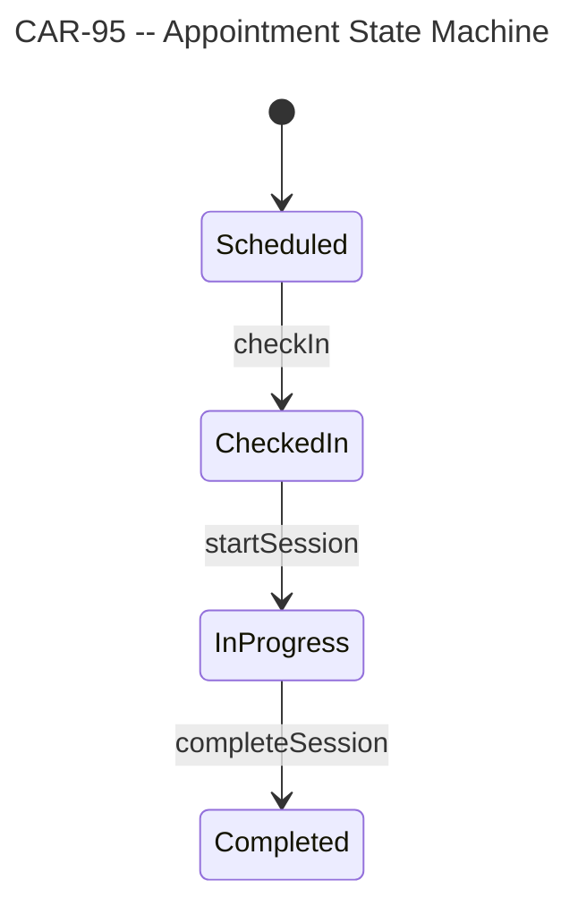

# Flowchart -- Generate Mermaid Diagrams from a Linear Issue

Parses a Linear issue's description and relations to produce `.mmd` files for data models, state machines, lifecycles, and dependency graphs.

## Quick Start

1. Fetch the issue with `mcp__linear-server__get_issue` (set `includeRelations: true`).
2. Scan the description for diagrammable content.
3. Write one `.mmd` file per diagram to `docs/diagrams/<issue-id-lowercase>/`.

## Instructions

### Step 1: Fetch the Issue

Call `mcp__linear-server__get_issue` with:
- `issueId`: the provided Linear issue ID (e.g., `CAR-95`)
- `includeRelations`: `true`

If the issue is not found, report "Issue <ID> not found in Linear." and stop.

### Step 2: Parse the Description

Scan the issue description for:

- **Table schemas** -- columns, types, constraints, foreign keys
- **State machines / lifecycles** -- states, transitions, commands, guards
- **Entity relationships** -- one-to-many, many-to-many, parent-child
- **Dependency graphs** -- blocks, blockedBy, relatedTo from issue relations

If the description contains none of these, report "No diagrammable content found in <ID>." and stop.

### Step 3: Select Diagram Types

Choose the appropriate Mermaid diagram type for each piece of content found:

| Content | Diagram Type | Mermaid Syntax |
|---|---|---|
| Table schemas, data models | ER diagram | `erDiagram` |
| State machines, lifecycles | State diagram | `stateDiagram-v2` |
| Process flows, decision trees | Flowchart | `flowchart TD` |
| Issue dependency graphs | Flowchart | `flowchart LR` |

Generate multiple diagrams when the issue describes multiple distinct entities or lifecycles. Prefer focused diagrams over a single overloaded chart.

### Step 4: Generate Diagrams

For each diagram, produce a `.mmd` file with YAML frontmatter:



Diagram-specific rules:

- **ER diagrams**: Include column types (`string`, `uuid`, `timestamp`, etc.), constraints (`PK`, `FK`, `NOT NULL`), and relationship cardinality (`||--o{`, `}o--||`).
- **State diagrams**: Annotate transitions with the command or event name. Add `[*]` for initial and terminal states. Include guard conditions in square brackets when present.
- **Flowcharts (dependencies)**: Use solid arrows (`-->`) for "blocks" relationships, dashed arrows (`-.->`) for "related to" relationships. Label arrows with the relationship type.
- **Flowcharts (process)**: Use decision diamonds for branching, rounded rectangles for actions.

### Step 5: Write Files

Create the output directory and write files:

```bash
mkdir -p docs/diagrams/<issue-id-lowercase>
```

File naming convention:
- `er-<entity-name>.mmd` -- for ER diagrams (e.g., `er-chart-note-template.mmd`)
- `state-<lifecycle-name>.mmd` -- for state diagrams (e.g., `state-appointment.mmd`)
- `flow-<process-name>.mmd` -- for process flowcharts (e.g., `flow-charting-pipeline.mmd`)
- `deps.mmd` -- for the issue dependency graph

### Step 6: Report

List every file created with its absolute path and a one-line description of what it depicts.

## Edge Cases

| Scenario | Action |
|---|---|
| Issue not found in Linear | Report the issue ID and stop. |
| Description is empty or has no diagrammable content | Report "No diagrammable content found" and stop. |
| Description is ambiguous (unclear states/entities) | Make the best interpretation and note assumptions in the diagram's title or a comment. |
| Issue has relations but no description | Generate only the dependency graph from issue relations. |
| Very large description with many entities | Split into multiple focused diagrams rather than one large chart. |

## Success Criteria

Flowchart generation is complete when:

- [ ] Linear issue was fetched successfully
- [ ] All diagrammable content was identified and categorized
- [ ] One `.mmd` file exists per diagram in `docs/diagrams/<issue-id-lowercase>/`
- [ ] Every `.mmd` file has a YAML frontmatter title
- [ ] File paths and generated file list were reported to the user
